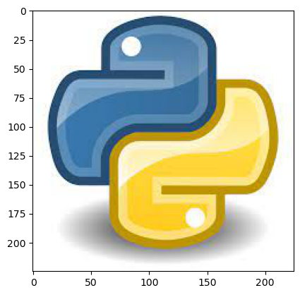
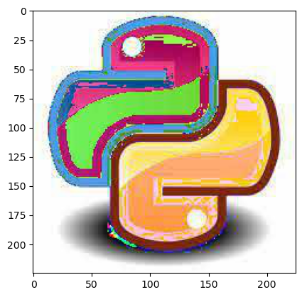

# Day 4 of 100 Days Data Science Bootcamp from noob to expert.

## Recap Day 3

Yesterday we have studied in detail about OOPs in Python.


NumPy is a library in Python that provides fast and efficient numerical operations on arrays. It is used extensively in data science and machine learning to perform mathematical operations on large datasets.

## Python list vs NumPy arrays

NumPy arrays are similar to Python lists, but they are more efficient and can perform operations faster. NumPy arrays are homogenous, meaning they can only contain elements of the same data type, while Python lists can contain elements of different data types. NumPy arrays also have a fixed size, while Python lists do not.


## Creating a NumPy Array

There are several ways to create a NumPy array:

* Basic ndarray: To create a basic NumPy array, we can use the numpy.array function. For example:


```python
import numpy as np

a = np.array([1, 2, 3, 4])
print(a)

```

    [1 2 3 4]


* Array of zeros: To create an array of zeros, we can use the numpy.zeros function. For example:


```python
a = np.zeros(5)
print(a)

```

    [0. 0. 0. 0. 0.]


* Array of ones: To create an array of ones, we can use the numpy.ones function. For example:


```python
a = np.ones(5)
print(a)
```

    [1. 1. 1. 1. 1.]


* Random numbers in ndarray: To create an array of random numbers, we can use the numpy.random.rand function. For example:


```python
a = np.random.rand(5)
print(a)
```

    [0.34150314 0.25977794 0.18726775 0.00209527 0.08221211]


* An array of your choice: To create an array with specific values, we can use the numpy.arange function. For example:


```python
a = np.arange(1, 11)
print(a)
```

    [ 1  2  3  4  5  6  7  8  9 10]


* Matrix in NumPy: To create a 2D array (matrix), we can use the numpy.matrix function. For example:


```python
a = np.matrix([[1, 2, 3], [4, 5, 6]])
print(a)
```

    [[1 2 3]
     [4 5 6]]


* Evenly spaced ndarray: To create an array with evenly spaced values, we can use the numpy.linspace function. For example:


```python
a = np.linspace(1, 10, 5)
print(a)
```

    [ 1.    3.25  5.5   7.75 10.  ]


## Shape and Reshaping of NumPy Array

* Dimensions of NumPy array: To get the dimensions of a NumPy array, we can use the ndarray.ndim attribute. For example:


```python
a = np.array([[1, 2, 3], [4, 5, 6]])
print(a.ndim)
```

    2


* Shape of NumPy array: To get the shape of a NumPy array, we can use the ndarray.shape attribute. For example:


```python
print(a.shape)
```

    (2, 3)


* Size of NumPy array: To get the total number of elements in a NumPy array, we can use the ndarray.size attribute. For example:


```python
print(a.size)
```

    6


* Reshaping a NumPy array: To reshape a NumPy array, we can use the ndarray.reshape function. For example:


```python
a = np.array([1, 2, 3, 4, 5, 6])
b = a.reshape(2, 3)
print(b)
```

    [[1 2 3]
     [4 5 6]]


* Flattening a NumPy array: To flatten a NumPy array, we can use the ndarray.flatten function. For example:


```python
a = np.array([[1, 2, 3], [4, 5, 6]])
b = a.flatten()
print(b)
```

    [1 2 3 4 5 6]


* Transpose of a NumPy array: To get the transpose of a NumPy array, we can use the ndarray.transpose function. For example:


```python
a = np.array([[1, 2, 3], [4, 5, 6]])
b = a.transpose()
print(b)
```

    [[1 4]
     [2 5]
     [3 6]]


## Expanding and Squeezing a NumPy Array

* To expand a NumPy array, we can use the numpy.expand_dims function. For example:


```python
a = np.array([1, 2, 3])
b = np.expand_dims(a, axis=1)
print(b)
```

    [[1]
     [2]
     [3]]


* To squeeze a NumPy array, we can use the numpy.squeeze function. For example:


```python
a = np.array([[1], [2], [3]])
b = np.squeeze(a)
print(b)
```

    [1 2 3]


## Indexing and Slicing of NumPy Array

* Slicing 1-D NumPy arrays: To slice a 1-D NumPy array, we can use the `ndarray[start:end:step]` notation. For example:


```python
a = np.array([1, 2, 3, 4, 5, 6])
b = a[1:4]
print(b)
```

    [2 3 4]


* Slicing 2-D NumPy arrays: To slice a 2-D NumPy array, we can use the `ndarray[row_start:row_end:row_step, col_start:col_end:col_step]` notation. For example:


```python
a = np.array([[1, 2, 3], [4, 5, 6], [7, 8, 9]])
b = a[0:2, 1:3]
print(b)
```

    [[2 3]
     [5 6]]


* Slicing 3-D NumPy arrays: To slice a 3-D NumPy array, we can use the `ndarray[dim1_start:dim1_end:dim1_step, dim2_start:dim2_end:dim2_step, dim3_start:dim3_end:dim3_step]` notation. For example:


```python
a = np.array([[[1, 2, 3], [4, 5, 6]], [[7, 8, 9], [10, 11, 12]]])
b = a[0:2, 0:2, 0:2]
print(b)
```

    [[[ 1  2]
      [ 4  5]]
    
     [[ 7  8]
      [10 11]]]


* Negative slicing of NumPy arrays: To slice a NumPy array with negative indices, we can use the `ndarray[-end:-start:-step]` notation. For example:


```python
a = np.array([1, 2, 3, 4, 5, 6])
b = a[-4:-1]
print(b)
```

    [3 4 5]


## Stacking and Concatenating Numpy Arrays

* Stacking ndarrays: To stack NumPy arrays vertically or horizontally, we can use the `numpy.vstack` or `numpy.hstack` functions. For example:


```python
a = np.array([1, 2, 3])
b = np.array([4, 5, 6])
c = np.vstack((a, b))
d = np.hstack((a, b))
print(c)
print(d)
```

    [[1 2 3]
     [4 5 6]]
    [1 2 3 4 5 6]


* Concatenating ndarrays: To concatenate NumPy arrays along a specific axis, we can use the `numpy.concatenate` function. For example:


```python
a = np.array([[1, 2], [3, 4]])
b = np.array([[5, 6], [7, 8]])
c = np.concatenate((a, b), axis=1)
print(c)
```

    [[1 2 5 6]
     [3 4 7 8]]


## Broadcasting in Numpy Arrays 

Broadcasting is a powerful feature in NumPy that allows us to perform arithmetic operations on arrays of different shapes. NumPy automatically broadcasts smaller arrays to match the shape of larger arrays in order to perform operations.

For example:


```python
a = np.array([1, 2, 3])
b = np.array([4, 5, 6])
c = a + b
print(c)
```

    [5 7 9]


## NumPy Ufuncs

NumPy provides a wide range of universal functions (ufuncs) that can be applied to arrays to perform mathematical operations. Some common ufuncs include:

* np.add: Adds two arrays element-wise
* np.subtract: Subtracts two arrays element-wise
* np.multiply: Multiplies two arrays element-wise
* np.divide: Divides two arrays element-wise
* np.abs: Calculates the absolute value of an array
* np.sin: Calculates the sine of an array
* np.cos: Calculates the cosine of an array
* np.exp: Calculates the exponent of an array


```python
a = np.array([1, 2, 3])
b = np.array([4, 5, 6])
c = np.add(a, b)
d = np.subtract(a, b)
e = np.multiply(a, b)
f = np.divide(a, b)
g = np.abs(a)
h = np.sin(a)
i = np.cos(a)
j = np.exp(a)
print(c)
print(d)
print(e)
print(f)
print(g)
print(h)
print(i)
print(j)
```

    [5 7 9]
    [-3 -3 -3]
    [ 4 10 18]
    [0.25 0.4  0.5 ]
    [1 2 3]
    [0.84147098 0.90929743 0.14112001]
    [ 0.54030231 -0.41614684 -0.9899925 ]
    [ 2.71828183  7.3890561  20.08553692]


## Maths with NumPy Arrays

NumPy provides many functions to perform mathematical operations on arrays. Some common functions include:

- np.mean: Calculates the mean of an array
- np.median: Calculates the median of an array
- np.std: Calculates the standard deviation of an array
- np.min: Calculates the minimum value of an array
- np.max: Calculates the maximum value of an array
- np.argmin: Calculates the index of the minimum value of an array
- np.argmax: Calculates the index of the maximum value of an array
- np.sort: Sorts an array in ascending order


```python
a = np.array([1, 2, 3, 4, 5])
mean = np.mean(a)
median = np.median(a)
std = np.std(a)
min_val = np.min(a)
max_val = np.max(a)
min_index = np.argmin(a)
max_index = np.argmax(a)
sorted_a = np.sort(a)
print(mean)
print(median)
print(std)
print(min_val)
print(max_val)
print(min_index)
print(max_index)
print(sorted_a)
```

    3.0
    3.0
    1.4142135623730951
    1
    5
    0
    4
    [1 2 3 4 5]


## NumPy Arrays and Images

NumPy arrays can be used to represent images. To read an image into a NumPy array, we can use the scipy.misc.imread function. To write a NumPy array as an image, we can use the scipy.misc.imsave function.


```python
import numpy as np
import imageio

# Read image into NumPy array
img = imageio.imread('image.jpeg')

# Perform some operations on the image
img = img * 2

# Save the modified image
imageio.imsave('modified_image.jpeg', img)

```

    /tmp/ipykernel_41196/1926062660.py:5: DeprecationWarning: Starting with ImageIO v3 the behavior of this function will switch to that of iio.v3.imread. To keep the current behavior (and make this warning dissapear) use `import imageio.v2 as imageio` or call `imageio.v2.imread` directly.
      img = imageio.imread('image.jpeg')


To display the image using matplotlib, you can use the same code as before:


```python
import numpy as np
import matplotlib.pyplot as plt

# Read image into NumPy array
img = imageio.imread('image.jpeg')

# Display image
plt.imshow(img)
plt.show()

```

    /tmp/ipykernel_41196/522357210.py:5: DeprecationWarning: Starting with ImageIO v3 the behavior of this function will switch to that of iio.v3.imread. To keep the current behavior (and make this warning dissapear) use `import imageio.v2 as imageio` or call `imageio.v2.imread` directly.
      img = imageio.imread('image.jpeg')


    

    


After Image


```python
# Read image into NumPy array
img = imageio.imread('modified_image.jpeg')

# Display image
plt.imshow(img)
plt.show()
```

    /tmp/ipykernel_41196/2499503535.py:2: DeprecationWarning: Starting with ImageIO v3 the behavior of this function will switch to that of iio.v3.imread. To keep the current behavior (and make this warning dissapear) use `import imageio.v2 as imageio` or call `imageio.v2.imread` directly.
      img = imageio.imread('modified_image.jpeg')


    

    

